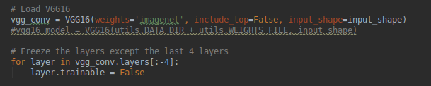
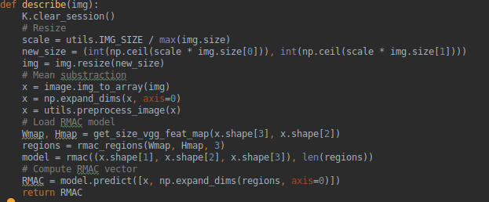
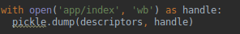
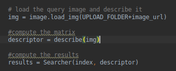
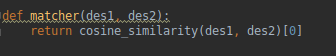
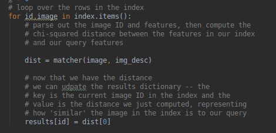
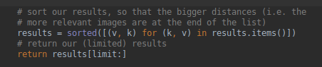
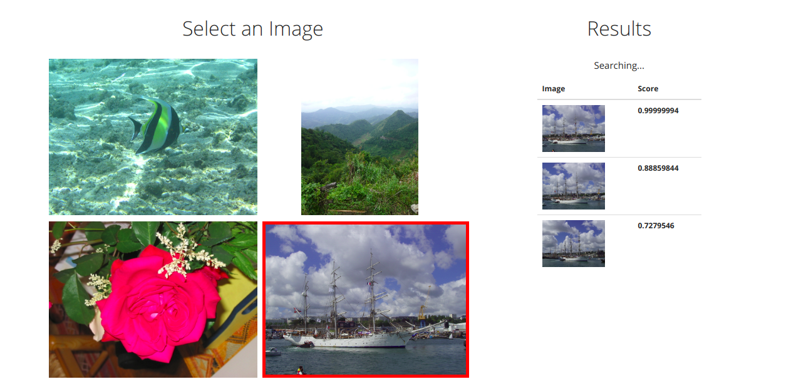

## Architecture logiciel
Le projet à été effectué sur ubuntu 18.04 avec
 - [Python][1] (2.7) 
 - [Keras][2] (2.1.2)
 - [Tensorflow][3] (1.12.0)
 - [Flask][4] (1.0.2)


### Citation
Le projet reprend l'architecture du projet ici :
    https://github.com/noagarcia/keras_rmac

et intègre l'interface web 
    https://www.pyimagesearch.com/2014/12/08/adding-web-interface-image-search-engine-flask/


Pour adapter l'interface web a une utilisation local, il est nécessaire de placer les dossiers **queries**(contenant les images à requêter)
et le dossier **mini_data** (contenant le dataset sur lequel tester) sous le dossier
**app/static**.

Il est nécessaire d'ajouter le fichier [VGG16][5] sous app/pyimagesearch/data/

This code is a re-implementation of RMAC for Keras. 

If using this code, please cite the paper where the re-implementation is used and the original RMAC paper:

```
@article{garcia2018asymmetric,
   author    = {Noa Garcia and George Vogiatzis},
   title     = {Asymmetric Spatio-Temporal Embeddings for Large-Scale Image-to-Video Retrieval},
   booktitle = {Proceedings of the British Machine Vision Conference},
   year      = {2018},
}
``` 
```
@article{tolias2016particular,
   author    = {Tolias, Giorgos and Sicre, Ronan and J{\'e}gou, Herv{\'e}},
   title     = {Particular object retrieval with integral max-pooling of CNN activations},
   booktitle = {Proceedings of the International Conference on Learning Representations},
   year      = {2016},
}
``` 


## Conditions de tests
La construction d'un index, pour plus de 800 images
a pris plus de 5h, pour un dataset d'une dizaine d'images.t 
C'est un résultat assez similaire auw Bag Of Word.
 

# Using Deep Networks to represent Images

### Calcul de la matrice



On utilise l'algorithme RMAC pour calculer nos features.





### Construction de l'index

De la même manire quePour le VBOW, il a fallu tout d'abord 
construire un index contenant l'id de l'image, 
ainsi que sa matrice correspondante.

Pour construire l'index, on calcul les descriptors de toutes 
les images du dataset 
et on les stocks dans un dictionnaire.


On sauvegarde ensuite l'index dans un fichier pour ne pas avoir à le 
recalculer à chaque fois qu'on lance le programme étant donné qu'il s'agit d'une
étape assez longue (cf. Conditions de tests)



Pour lancer le calcul de l'index :

    > python app/pyimagesearch/descriptor.py


### Recherche des images

Pour rechercher une image, on commence par calculer sa matrice.




Ensuite, pour trouver les images intéressantes, on parcour l'index en calculant
 la distance entre les matrices de l'index et celle de l'image.

On utilise donc cosine_similarity de scikit-learn.





r

De la même manière que pour le matcher, on ne garde que les meilleures résultats.
On a mis une limit = 3 par défaut. Les 3 dernières distances sont donc les meilleurs.




Pour lancer l'interface web :

    > python app/app.py
  
 

# Conclusion 

La recherche en utilisant le deep learning est beacoup plus efficace 
que les méthodes précédemment employé. Mais elle n'est cependant pas plus rapide.


## References
 - Frederic, P from Shallow to Deep Representation for multimedia database. Lectures 2019.
 - Tolias, G., Sicre, R., & Jégou, H. Particular object retrieval with integral max-pooling of CNN activations. ICLR 2016.
 - Gordo, A., Almazán, J., Revaud, J., & Larlus, D. Deep image retrieval: Learning global representations for image search. ECCV 2016.


[1]: https://www.python.org/download/releases/2.7/
[2]: https://keras.io/
[3]: https://www.tensorflow.org/install
[4]: https://pypi.org/project/Flask/0.8/
[5]: https://github.com/fchollet/deep-learning-models/releases/download/v0.1/vgg16_weights_th_dim_ordering_th_kernels.h5