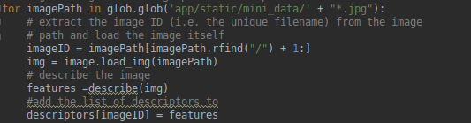

## Architecture logiciel
Le projet à été effectué sur ubuntu 18.04 avec
 - [Python][1] (2.7) 
 - [Keras][2] (2.1.2)
 - [Tensorflow][3] (1.12.0)
 - [Flask][4] (1.0.2)

### Citation
Le projet reprend l'architecture du projet ici :
    https://github.com/noagarcia/keras_rmac

et intègre l'interface web 
    https://www.pyimagesearch.com/2014/12/08/adding-web-interface-image-search-engine-flask/

Pour adapter l'interface web a une utilisation local, il est nécessaire de placer les dossiers **queries**(contenant les images à requêter)
et le dossier **mini_data** (contenant le dataset sur lequel tester) sous le dossier
**app/static**.

## Conditions de tests
La construction d'un index, pour plus de 800 images
a pris plus de 5h, pour un dataset d'une dizaine d'images.t 
C'est un résultat assez similaire auw Bag Of Word.
 

# Using Deep Networks to represent Images

### Calcul de la matrice

### Construction de l'index

De la même manire quePour le VBOW, il a fallu tout d'abord 
construire un index contenant l'id de l'image, 
ainsi que sa matrice correspondante.

Pour construire l'index, on calcul les descriptors de toutes 
les images du dataset 
et on les stocks dans un dictionnaire.

On sauvegarde ensuite l'index dans un fichier pour ne pas avoir à le 
recalculer à chaque fois qu'on lance le programme étant donné qu'il s'agit d'une
étape assez longue (cf. Conditions de tests)

Pour lancer le calcul de l'index :

    > python app/pyimagesearch/descriptor.py

### Recherche des images

Pour rechercher une image, on commence par calculer sa matrice.

Ensuite, pour trouver les images intéressantes, on calcul
la matrice de l'image, puis on parcour l'index en calculant
 la distance entre les matrices de l'index et celle de l'image.

On utilise donc cosine_similarity de scikit-learn.

r

De la même manière que pour le matcher, on ne garde que les meilleures résultats.
On a mis une limit = 3 par défaut. Les 3 dernières distances sont donc les meilleurs.

Pour lancer l'interface web :

    > python app/app.py
  
 

# Conclusion 

La recherche en utilisant le deep learning est beacoup plus efficace 
que les méthodes précédemment employé. Mais elle n'est cependant pas plus rapide.

[1]: https://www.python.org/download/releases/2.7/
[2]: https://keras.io/
[3]: https://www.tensorflow.org/install
[4]: https://pypi.org/project/Flask/0.8/